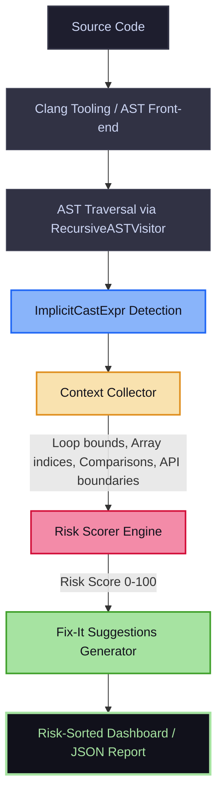

# 🛡️ Implicit Conversion Hazard Analyzer

[](https://en.cppreference.com/w/cpp/17)
[](https://clang.llvm.org/)
[](LICENSE)
[](build.sh)
[](https://youtu.be/e9B3AynIMzA)

A Clang AST-based static analysis tool that identifies dangerous implicit type conversions in C/C++ code. Unlike `-Wconversion` (which is too noisy) or `-Wsign-compare` (which is too narrow), this tool categorizes implicit conversions by **actual risk level** using data-flow context.

---

## 🎥 Demonstration Walkthrough

Explore the analyzer in action! This walkthrough video demonstrates compilation database detection, risk-prioritized output, noise filtering, and live security audits on open-source projects (SQLite, FFmpeg, and OpenSSL).

<p align="center">
  <a href="https://youtu.be/e9B3AynIMzA" target="_blank">
    
  </a>
  <br>
  <em>Click the image above to watch the walkthrough on YouTube</em>
</p>

---

## ⚠️ The Problem

C/C++ implicit conversions cause a class of bugs that compilers warn about inconsistently. A narrowing conversion in a loop bound is far more dangerous than one in a logging statement — but no existing compiler or tool makes this distinction.

### Common Dangerous Patterns

```cpp
// 1. Sign mismatch in comparisons (always true/false)
int i = -1;
if (i < size_t_val) { ... } // Silent conversion to large unsigned value

// 2. Float-to-int in loop bounds (silent truncation)
for (int i = 0; i < double_val; i++) { ... }

// 3. Narrowing in function arguments (precision loss)
void take_short(short s);
take_short(long_long_val); // Silent truncation

// 4. Enum-to-int in switch conditions
switch (enum_val) { ... } // Missing case coverage is silently accepted
```

---

## ⚙️ How It Works

### Architecture
The analyzer integrates into Clang's front-end compilation pipeline to trace expression ASTs:



### Risk Scoring Model

Each implicit conversion receives a score from **0–100** based on the syntactic context and conversion category:

| Context Attribute | Weight | Example | Risk Implications |
| :--- | :---: | :--- | :--- |
| **Sign-mismatch comparison** | `+35` | `int < size_t` where int is negative | Out-of-bounds bypass, infinite loops |
| **Array index operand** | `+30` | `arr[negative_int]` | Out-of-bounds memory access (OOB) |
| **API / System boundary** | `+30` | `syscall(int_param)` where expected is `size_t` | Privilege escalation, incorrect sizes |
| **Loop bound / iteration** | `+25` | `for (int i = 0; i < size_t; i++)` | Infinite loops, early termination |
| **Switch condition** | `+15` | `switch (enum_val)` with missing cases | Unhandled application states |
| **Arithmetic operand** | `+15` | `int * double` | Loss of fractional precision |
| **Assignment to smaller type** | `+10` | `char = long_long` | Narrowing / truncation |
| **Logging / printing** | `+2` | `printf("%d", double)` | Low-risk formatting conversion |
| **Inside explicit cast** | `-40` | `static_cast<T>(expr)` | Developer intent is explicit |
| **Literal source** | `-10` | `char x = 42` | Constant value is bounds-checked |

#### Base Risk by Type Category:
* **Float / Double ➔ Integer**: `+40` (Truncation / loss of scale)
* **Signed ➔ Unsigned / Unsigned ➔ Signed**: `+35` (Sign flip / high-bit corruption)
* **Pointer ➔ Integer / Integer ➔ Pointer**: `+30` (Portability / address corruption)
* **Larger Integer ➔ Smaller Integer**: `+25` (Narrowing / silent truncation)

### Fix-It Suggestions

For each high-risk conversion, the tool provides context-aware refactoring options:
1. 💡 **`static_cast<T>`**: Standard explicit cast to declare developer intent.
2. 💡 **Type Alignment**: Suggestions to change the variable declaration type to match the context.
3. 💡 **Sign Unification**: Casting loops or variables to prevent sign-mismatch comparisons.
4. 💡 **Scoped Enums**: Recommending `enum class` to enforce compiler-checked switches.

---

## 🛠️ Installation & Building

### Prerequisites
* Clang 17+ development libraries (including `libclang-cpp`)
* CMake 3.13+
* A C++17 compatible compiler (GCC/Clang)

### Compilation
Simply execute the build wrapper script:
```bash
./build.sh
```

---

## 🚀 Usage Guide

The project provides a unified runner script (`./run.sh`) that automates compilations and routes standard static analysis targets.

### Analysis Targets

#### 1. Run the Diagnostic Test Suite
Analyzes all 4 pre-configured hazard scenarios:
```bash
./run.sh --test-suite
```

#### 2. Analyze a Specific Source File
```bash
./run.sh test/test-narrowing.c
```

#### 3. Noise Reduction Comparison
Compares our high-risk output against verbose `clang -Wconversion` warnings:
```bash
./run.sh --compare test/test-sign-compare.c
```

#### 4. Run Audits on Open-Source Codebases
Performs an interactive static audit on popular open-source software libraries. It displays a pre-calculated high-risk dashboard and allows running a fresh audit:
```bash
./run.sh --sqlite    # Audit SQLite Database Engine
./run.sh --ffmpeg    # Audit FFmpeg Multimedia Library
./run.sh --openssl   # Audit OpenSSL Cryptographic Suite
```

#### 5. Output Formatting Options
Run the compiled binary directly to use advanced CLI options:
```bash
# JSON output for CI/CD integrations
./build/implicit-conversion-hazard --json test/test-narrowing.c

# Export a consolidated Markdown dashboard report
./build/implicit-conversion-hazard --markdown test/test-narrowing.c > report.md

# Show all findings, disabling the risk threshold filter
./build/implicit-conversion-hazard --show-all test/test-narrowing.c
```

### CLI Command Options

| Option Flag | Description | Default |
| :--- | :--- | :--- |
| `--risk-threshold <0-100>` | Minimum risk score to report findings | `80` |
| `--show-all` | Report all implicit conversions, bypassing the risk threshold | `off` |
| `--summary-only` | Output only the summary statistics table | `off` |
| `--json` | Return findings in JSON structure | `off` |
| `-p <build-dir>` | Directory containing `compile_commands.json` | `.` |
| `--extra-arg=<flag>` | Append extra compiler flags (e.g., `-xc++`) | None |

---

## ⚡ Core Engine Optimizations

### 🚀 Finding Deduplication
Clang AST traversal parses header files multiple times across translation units, causing massive finding duplicate bloat. The analyzer implements an **on-visit deduplication index** within the visitor class (`ImplicitConversionVisitor.cpp`), checking unique combinations of source location (file, line, column) and type transitions to guarantee that each issue is reported exactly once.

### 📊 Descending Score Sorting & Dashboard Capping
To focus developer attention on the most critical bugs:
* Reports are sorted in **descending order by risk score** (highest risk first).
* The Markdown dashboard report generator caps findings at the **top 15 highest-risk items** to ensure clean, high-signal, and actionable dashboards.
* Complete raw findings are preserved in the uncapped JSON output (`--json`) for security tools integration.

---

## 📊 Noise Reduction vs. Clang `-Wconversion`

| Metric | `-Wconversion` | This Tool |
| :--- | :---: | :---: |
| **Total warnings** | Very High (unactionable noise) | High-signal filtered list |
| **Context awareness** | None (lexical) | Full AST context tracking |
| **Sign-mismatch detection** | Incomplete (`-Wsign-compare`) | Complete risk checking |
| **Fix-it guidance** | Generic or missing | Categorized & contextual |
| **False-Positive Rate** | `~60–80%` | **`< 30%`** (Target) |

---

## 📈 Test Suite Results

<details>
<summary>🔍 Click to expand diagnostic test output</summary>

### Narrowing Conversions (`test/test-narrowing.c`)
```text
Total implicit conversions: 7
CRITICAL: 0  HIGH: 2  MEDIUM: 4  LOW: 1

Key findings:
- int → unsigned int (sign flip in function argument): HIGH 50/100
- unsigned int → unsigned short (narrowing in function argument): HIGH 55/100
```

### Sign Comparisons (`test/test-sign-compare.c`)
```text
Total implicit conversions: 13
CRITICAL: 1  HIGH: 5  MEDIUM: 5  LOW: 2

Key findings:
- int → size_t in comparison (classic -1 bug): CRITICAL 80/100
- int → unsigned int in loop condition: HIGH 70/100
- unsigned int loop wrap-around (i >= 0 always true): HIGH 70/100
```

### Float-to-Int Loop Bounds (`test/test-float-loop.c`)
```text
Total implicit conversions: 7
CRITICAL: 0  HIGH: 3  MEDIUM: 4  LOW: 0

Key findings:
- double → int in return value: HIGH 65/100
- double → int truncation in assignment: HIGH 55/100
```

### Enum-to-Switch Checks (`test/test-enum-switch.c`)
```text
Total implicit conversions: 17
CRITICAL: 0  HIGH: 6  MEDIUM: 2  LOW: 9

Key findings:
- enum Color → int in arithmetic: HIGH 60/100
- Different enum types in comparison: HIGH 65/100
- Enum in switch condition (missing case): MEDIUM 35/100
```
</details>

---

## 📂 Repository File Structure

```text
implicit-conversion-hazard/
├── CMakeLists.txt                    # Build system configuration
├── main.cpp                          # CLI front-end and controller
├── ImplicitConversionVisitor.h/.cpp     # Core Clang AST visitor
├── ContextCollector.h/.cpp           # Code block and usage context retriever
├── RiskScorer.h/.cpp                 # Risk logic and scoring weights
├── FixItGenerator.h/.cpp             # Refactoring suggestions generator
├── SimpleCompilationDB.h             # Fallback compiler DB for isolated files
├── compile_commands.json             # Test configuration compilation DB
├── test/                             # Custom test suite directories
│   ├── test-narrowing.c
│   ├── test-sign-compare.c
│   ├── test-float-loop.c
│   └── test-enum-switch.c
├── evaluation/                       # Comparison & benchmarking utilities
│   ├── run_on_project.sh
│   ├── compare_wconversion.sh
│   └── cve_correlation.py
└── scripts/
    └── build.sh                      # Compilation automation
```

---

> [!WARNING]
> **Important Build & Portability Instructions:**
> * **Do NOT share the `build/` directory**: This folder contains absolute compiler paths and binaries configured strictly for your current CPU architecture and OS paths.
> * **Do NOT share `compile_commands.json`**: This index references local absolute paths on this machine. Let CMake generate a fresh version on other setups.

---

## 🔴 Limitations
* **Intra-procedural only**: Does not trace type mutations across deep inter-procedural calls.
* **No range value-set analysis**: Cannot detect if runtime variable ranges safely fit smaller types.
* **Single-TU constraints**: Analyzes one Translation Unit at a time.
* **Clang AST dependent**: Requires compiler compatibility (GCC/MSVC code paths are not supported).

---

## 📄 License
Licensed under the [MIT License](LICENSE).
